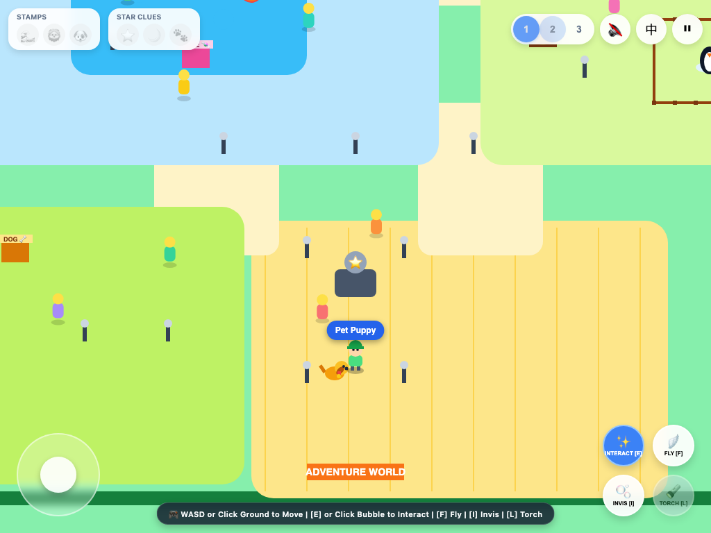
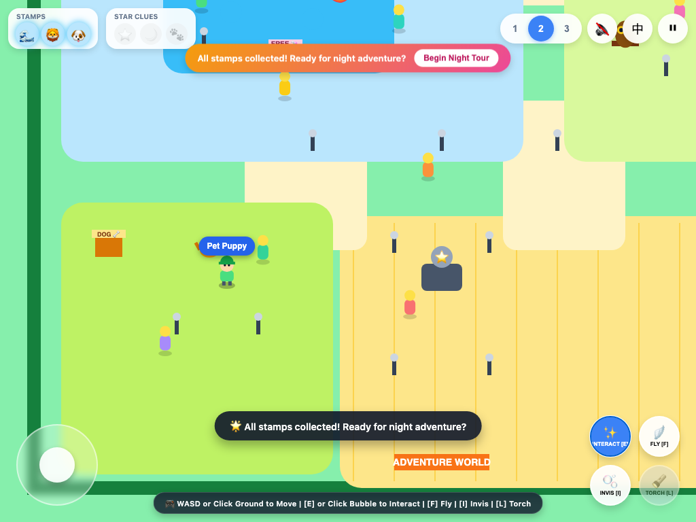
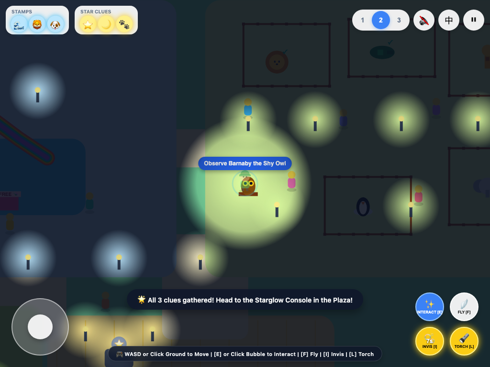
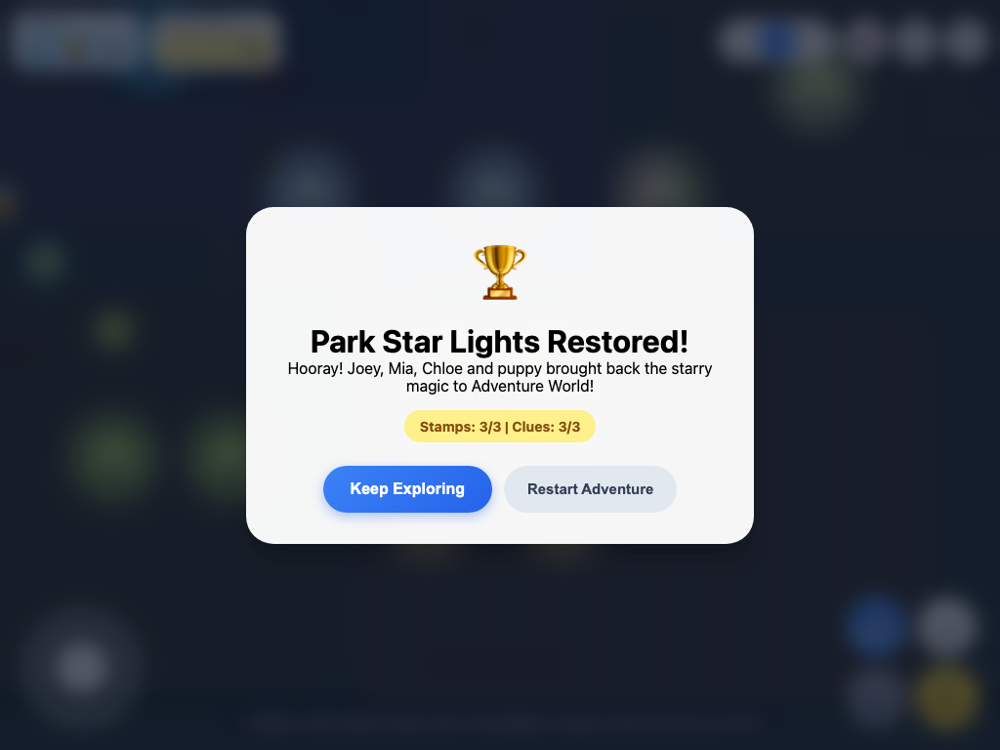
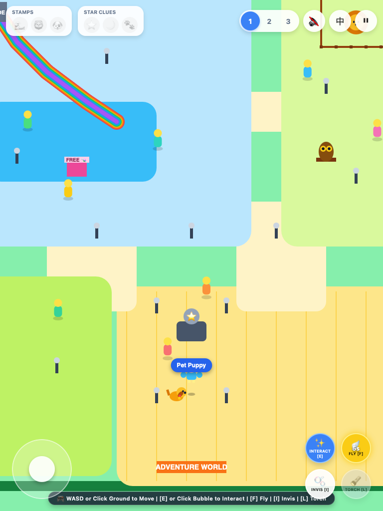
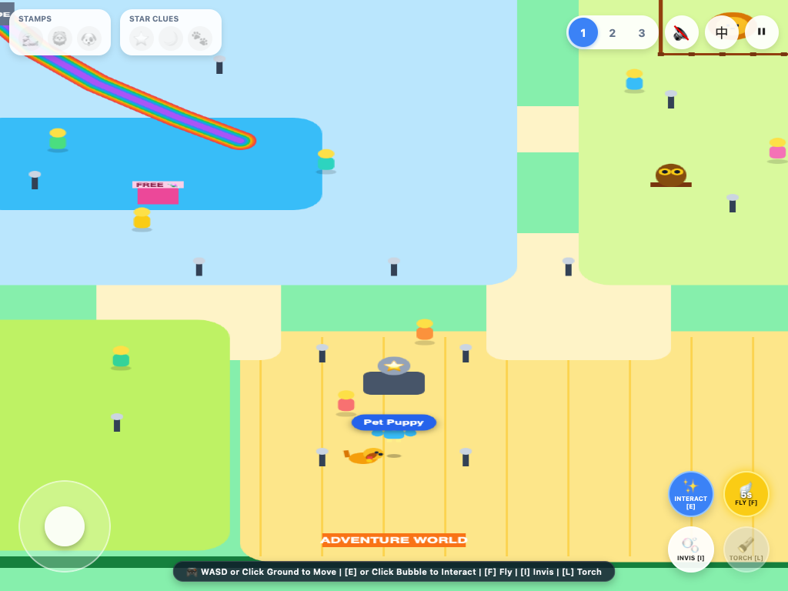

# 2026-09-17 独立终版验收证据

对应代码提交：`392ed683daeb5e15ab89194c4ad6d491ad526589`。

先读 [CLASSROOM_HANDOFF.md](../../../CLASSROOM_HANDOFF.md)。

[结构化实测结果](results.json)。测试方法与未测边界见交接文档；这些图片来自独立浏览器，WebKit图片不是实体iPad证明。

## adventure-day.png

## adventure-stamps.png

## adventure-night.png

## adventure-victory.png

## adventure-webkit-portrait.png

## adventure-webkit-landscape.png

